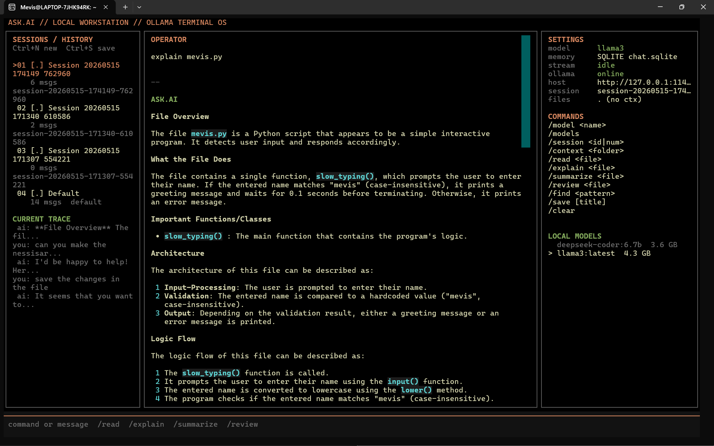
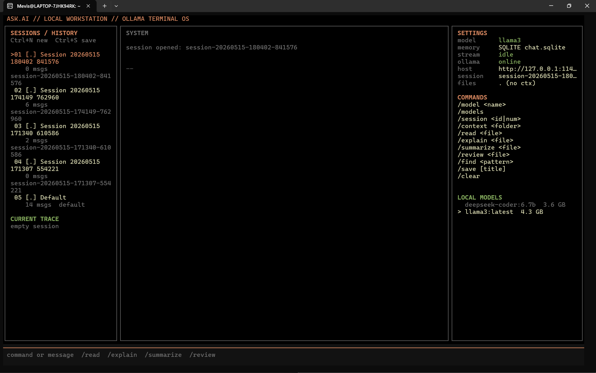

# ask.ai

> Offline AI workstation built for the terminal.

ask.ai is a local AI-powered terminal assistant designed for developers, Linux users, and cybersecurity enthusiasts who want fast AI assistance without relying on cloud services.

Built on top of Ollama and local LLMs, ask.ai runs completely offline, supports multiple models, streams responses in real time, analyzes files, remembers conversations locally, and provides a workstation-style terminal interface.

---

# Documentation

Detailed documentation is available in the [`docs/`](./docs/) directory:

| File | Description |
|------|-------------|
| [OVERVIEW.md](./docs/OVERVIEW.md) | High-level overview and feature summary |
| [ARCHITECTURE.md](./docs/ARCHITECTURE.md) | System architecture and design decisions |
| [COMMANDS.md](./docs/COMMANDS.md) | Complete command reference |
| [KEYBOARD_SHORTCUTS.md](./docs/KEYBOARD_SHORTCUTS.md) | Textual workstation keyboard shortcuts |
| [CONFIGURATION.md](./docs/CONFIGURATION.md) | All configuration options and env variables |
| [SETUP.md](./docs/SETUP.md) | Installation and troubleshooting guide |

---

# Preview

## Neural Workstation UI



---

# Features

## Local & Offline

* Runs fully offline using Ollama
* No internet connection required
* Local-first workflow
* Better privacy and control over data

## Real-Time Streaming

* Token-by-token streaming responses
* Smooth terminal interaction
* Fast response rendering
* Plain-text output — fully selectable and copyable

## Multi-Model Support

Switch between different local models directly from the terminal.

Examples:

* llama3
* deepseek-coder
* mistral
* codellama

## Model Router

Automatically selects the best model for each task:

| Task       | Default Model          |
|------------|------------------------|
| Coding     | `deepseek-coder:6.7b`  |
| Chat       | `llama3`               |
| Summary    | `mistral`              |

Configure in `config.json` or via environment variables (`ASK_ROUTER_*`).

## Workspace Context System

Load an entire project folder as read-only context for the AI:

```bash
/workspace ./src
/context            # show current context summary
/clear-context      # clear loaded workspace
```

ask.ai recursively scans project files, ignores `.git`, `node_modules`, `venv`, `__pycache__`, `dist`, `build`, and skips binary/sensitive files.

## File Intelligence

ask.ai can:

* read files
* explain code
* summarize files
* review source code
* analyze project structure

Supported workflows:

```bash
/explain main.py
/review app.js
/summarize config.yaml
```

## Local RAG / Semantic Search

Local vector search over project files using ChromaDB + sentence-transformers:

```bash
/workspace ./src        # index project files
"Where is auth implemented?"   # semantic search over indexed files
```

* Fully offline
* Persistent vector database
* Sentence embeddings for semantic understanding
* Configure via `config.json` (`rag.enabled`, `rag.embedding_model`, etc.)

## Git Integration

Safe, read-only git operations from within the workstation:

```bash
/git-status         # working tree status
/git-diff           # unstaged diff
/git-log            # recent commits
/explain-commit     # AI explains staged changes
/generate-commit    # AI generates commit message from diff
```

No destructive git commands are exposed.

## Session Memory System

* Persistent chat history (SQLite)
* Session tracking with metadata
* Session listing and switching
* Session save/resume

```bash
/sessions           # list all sessions
/session <id>       # switch to a session
/resume <id>        # alias for /session
/new                # create new session
/save [title]       # save current session
```

## Export & Copy

* `/copy` — copy last AI response to clipboard
* `/print` — print last response to terminal scrollback (selectable)
* `/save-file <path>` — save last response to a file
* `/export` — export full session as markdown

## Syntax Highlighting

* Rich-based code rendering
* Automatic language detection
* Clean terminal formatting

## Workstation UI

* Terminal-based interface
* Three-pane layout (sessions, chat, settings)
* Dedicated home screen with recent sessions, workspace actions, shortcuts, and tips
* `Ctrl+P` command palette with fuzzy search across commands, sessions, models, and files
* Status indicators (model, memory, Ollama, git, context)
* Readable AI-generated session titles with manual rename support
* Session management
* Retro workstation-inspired layout
* Clipboard copy (Ctrl+Y)
* Selectable text output

---

# Tech Stack

| Component              | Technology                 |
| ---------------------- | -------------------------- |
| AI Backend             | Ollama                     |
| Models                 | LLaMA 3, DeepSeek, Mistral |
| Language               | Python                     |
| CLI Framework          | Typer                      |
| Terminal Rendering     | Rich                       |
| TUI System             | Textual                    |
| Vector Database        | ChromaDB                   |
| Embeddings             | sentence-transformers      |
| Local Database         | SQLite / FTS5              |
| Packaging              | setuptools                 |

---

# Installation

## Docker (Recommended)

The easiest way to run `ask.ai` is via Docker. This ensures all dependencies (including RAG components) are correctly configured.

### 1. Build and Run

```bash
docker-compose up --build
```

### 2. Easy Mode (Recommended)

To run `askai` from anywhere as a simple command, add an alias to your `~/.bashrc` or `~/.zshrc`:

```bash
# Add this to your shell config
alias askai='/path/to/Ask-ai/askai-docker.sh'
```

Now you can just type:
*   `askai` - Launch the TUI
*   `askai chat` - Start a chat
*   `askai analyze myfile.py` - Analyze a file in your current directory

### 3. Manual Usage

*   **TUI (Default):** `docker compose run --rm ask`
*   **Plain Chat:** `docker compose run --rm ask chat`
*   **Analyze local files:**
    ```bash
    docker compose run --rm -v $(pwd):/workspace:ro ask analyze /workspace/myfile.py
    ```

**Note:** On Linux, `host.docker.internal` is mapped via `extra_hosts` in `docker-compose.yml` to allow the container to reach Ollama running on your host machine.

---

## Local Installation

### 1. Clone Repository

```bash
git clone https://github.com/Mevis-byte/Ask-ai.git
cd Ask-ai
```

---

## 2. Create Virtual Environment

### Linux / macOS

```bash
python3 -m venv venv
source venv/bin/activate
```

### Windows

```powershell
python -m venv venv
venv\Scripts\activate
```

---

## 3. Install Requirements

```bash
pip install -r requirements.txt
```

For RAG / semantic search (optional):

```bash
pip install ask[rag]
# or
pip install chromadb sentence-transformers
```

---

## 4. Install Ollama

Download Ollama:

[https://ollama.com](https://ollama.com)

Pull a model:

```bash
ollama pull llama3
```

Optional models:

```bash
ollama pull deepseek-coder:6.7b
ollama pull mistral
```

---

# Running ask.ai

```bash
python -m ask.main ai
```

or:

```bash
askai (recommended)
```

---

# Commands

| Command                 | Description                     |
| ----------------------- | ------------------------------- |
| `ask ai`                | Launch workstation UI           |
| `ask chat`              | Start plain-terminal chat (selectable output) |
| `ask analyze <file>`    | Analyze source code             |
| `/workspace <dir>`      | Load project folder as context  |
| `/context`              | Show current workspace summary  |
| `/clear-context`        | Clear loaded workspace context  |
| `/read <file>`          | Display file contents           |
| `/explain <file>`       | Explain file logic              |
| `/review <file>`        | Review code quality             |
| `/summarize <file>`     | Summarize file                  |
| `/find <pattern>`       | Search context for pattern      |
| `/git-status`           | Show working tree status        |
| `/git-diff [file]`      | Show unstaged diff              |
| `/git-log [n]`          | Show recent commits             |
| `/explain-commit`       | AI explains staged changes      |
| `/generate-commit`      | AI generates commit message     |
| `/sessions`             | List saved sessions             |
| `/session <id\|num>`   | Switch to a session             |
| `/model <name>`         | Switch AI model                 |
| `/models`               | List installed models           |
| `/copy`                 | Copy last response to clipboard |
| `/print`                | Print response to scrollback    |
| `/save-file <path>`     | Save last response to file      |
| `/export`               | Export full session as markdown |
| `/clear`                | Clear session transcript        |
| `/help`                 | Display all commands            |
| `/quit`                 | Exit Ask.ai                     |
---

# Project Structure

```text
ask/
├── app/              # Application layer
│   ├── chat.py            # REPL chat loop
│   ├── workstation.py     # Textual app builder
│   ├── session_manager.py # Session CRUD
│   ├── analysis.py        # File analysis
│   └── bootstrap.py       # DI container
│
├── config/           # Configuration
│   ├── defaults.py        # Built-in defaults
│   ├── settings.py        # Settings dataclass + loader
│   ├── json_file.py       # JSON config reader
│   ├── merge.py           # Recursive dict merge
│   └── paths.py           # Config file resolution
│
├── memory/           # Conversation memory
│   ├── protocol.py        # ChatMemory protocol
│   ├── types.py           # ChatMessage TypedDict
│   ├── in_memory.py       # In-memory store
│   ├── sqlite_memory.py   # SQLite + FTS5
│   └── factory.py         # Memory factory
│
├── models/           # AI model layer
│   ├── protocols.py       # ChatBackend protocol
│   ├── ollama_backend.py  # Ollama client
│   └── router.py          # Task-based model router
│
├── rag/              # Retrieval-Augmented Generation
│   ├── base.py            # Document + Retriever protocol
│   ├── chroma_retriever.py # ChromaDB vector retriever
│   ├── factory.py         # Retriever factory
│   ├── injection.py       # Context injection
│   └── none_retriever.py  # No-op default
│
├── plugins/          # Plugin system
│   ├── base.py            # Plugin base class
│   ├── registry.py        # Plugin registry
│   └── git/               # Git integration plugin
│       ├── __init__.py
│       └── plugin.py
│
├── files/            # File system access
│   ├── local_context.py   # Bounded file I/O + context
│   └── __init__.py
│
├── tools/            # File analysis tools
│   └── files.py           # Language detection, prompts
│
├── streaming/        # Stream processing
│   └── pipeline.py        # Token iteration, accumulation
│
├── ui/               # User interfaces
│   ├── console_ui.py      # Rich-based REPL
│   ├── workstation.py     # Textual TUI
│   ├── theme.py           # Color palette
│   └── startup.py         # Boot animation
│
└── main.py           # CLI entrypoint (Typer)
```

---

# Why ask.ai?

Most AI assistants today are:

* cloud dependent
* subscription locked
* privacy invasive
* browser focused

ask.ai was built around a different idea:

```text
AI should feel like part of your operating system.
```

The goal is to create a local AI workstation that integrates naturally into terminal workflows while remaining private, customizable, and developer-focused.

---

# Configuration

ask.ai uses a layered configuration system:

1. **Built-in defaults** — sensible defaults for all settings
2. **`config.json`** — user config file (in `~/.config/ask/config.json` or `./config.json`)
3. **Environment variables** — `ASK_*` overrides (12-factor style)

## config.json sections

```json
{
  "models": {
    "ollama_host": "http://127.0.0.1:11434",
    "chat_model": "llama3",
    "analyze_model": "deepseek-coder:6.7b"
  },
  "rag": {
    "enabled": false,
    "top_k": 4,
    "embedding_model": "all-MiniLM-L6-v2",
    "chunk_size": 512,
    "chunk_overlap": 64,
    "persist_directory": "~/.local/share/ask/rag_index"
  },
  "router": {
    "enabled": false,
    "default_model": "llama3",
    "coding_model": "deepseek-coder:6.7b",
    "chat_model": "llama3",
    "summary_model": "mistral"
  },
  "git": {
    "enabled": true,
    "max_diff_lines": 200
  },
  "memory": {
    "max_messages": 80,
    "persist_path": "~/.local/share/ask/chat.sqlite",
    "context_search_enabled": true,
    "context_search_top_k": 6,
    "context_exclude_recent_messages": 24
  },
  "streaming": {
    "live_markdown": true,
    "refresh_per_second": 20
  },
  "ui": {
    "banner_font": "slant",
    "banner_title": "ASK AI",
    "banner_subtitle": "Offline Developer AI Assistant",
    "startup_animation": true,
    "typing_delay_ms": 8
  }
}
```

Override any setting via environment variables:

```bash
export ASK_OLLAMA_HOST=http://localhost:11434
export ASK_CHAT_MODEL=llama3
export ASK_RAG_ENABLED=true
export ASK_ROUTER_ENABLED=true
export ASK_GIT_ENABLED=true
```

# Roadmap

See [ROADMAP.md](./ROADMAP.md) for planned features and future direction.

---

# Security & Privacy

ask.ai is designed with a local-first workflow.

* Conversations stay on device
* Files are analyzed locally
* No cloud APIs required
* No external data collection

Current implementation is read-focused and avoids unrestricted system modification.

See [SECURITY.md](./SECURITY.md) for the full security policy.

---

# Screenshots

## Main Interface



---

# Contributing

Contributions are welcome. See [CONTRIBUTING.md](./CONTRIBUTING.md) for the full guide on how to get started.

---

# Author

Mevis Lobo

GitHub:
[https://github.com/Mevis-byte](https://github.com/Mevis-byte)

---

# License

MIT License
