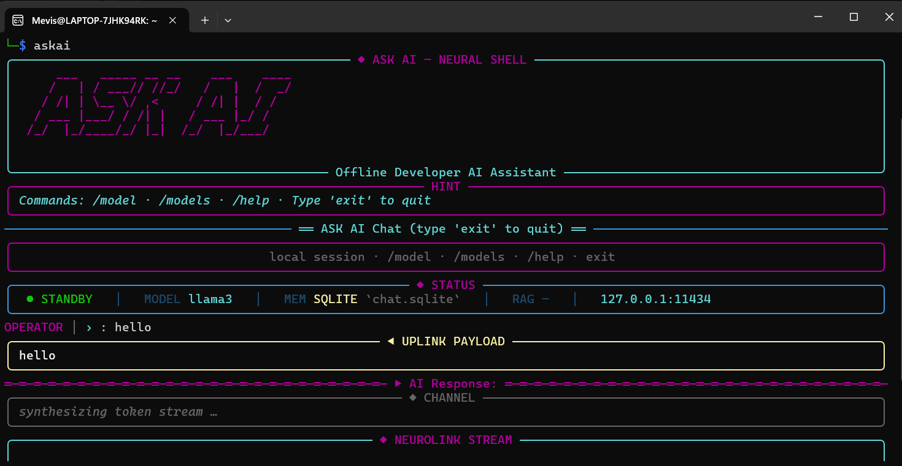

# ask.ai

A local AI assistant that runs directly inside the terminal using Ollama and LLaMA 3.

ask.ai is designed for people who want fast, private, and offline AI access without depending on cloud APIs or subscriptions. The project focuses on coding assistance, file analysis, debugging, and general AI interaction while keeping everything on the user's machine.

---

## Overview

Most AI tools today rely on cloud infrastructure. That means internet dependency, API limits, subscriptions, latency, and privacy concerns.

ask.ai takes a different approach.

The entire system runs locally using Ollama with the LLaMA 3 model, allowing users to interact with AI completely offline from the terminal.

The assistant is optimized for:

* Coding help
* File analysis
* Debugging
* CLI workflows
* Learning and experimentation
* Offline environments

---

## Main Features

### Offline Execution

ask.ai works fully offline using locally installed Ollama models.

### Privacy Focused

No cloud APIs or external processing. Everything stays on the local machine.

### Streaming Responses

Real-time token streaming directly inside the terminal for faster and smoother interaction.

### Syntax Highlighted Output

Code responses are rendered with syntax highlighting for better readability.

### Multi-Model Support

Switch between different Ollama models dynamically.

Example:

```bash
/model llama3
/model mistral
```

### Coding Assistance

Supports:

* Code generation
* Debugging
* Refactoring help
* Algorithm explanations
* Multiple programming languages

### File Analysis

Analyze local source files and receive context-aware explanations.

### Terminal-Based UI

Built for CLI workflows with Rich-powered terminal rendering.

---

## Tech Stack

| Component     | Technology |
| ------------- | ---------- |
| Language      | Python     |
| Model Runtime | Ollama     |
| AI Model      | LLaMA 3    |
| CLI Framework | Typer      |
| Terminal UI   | Rich       |
| Validation    | Pydantic   |

Dependencies are managed through `requirements.txt`. fileciteturn0file0

---

## Installation

### Clone the Repository

```bash
git clone https://github.com/Mevis-byte/Ask-ai.git
cd Ask-ai
```

### Install Dependencies

```bash
pip install -r requirements.txt
```

### Install Ollama

urlOllama[https://ollama.com](https://ollama.com)

### Download the Model

```bash
ollama run llama3
```

---

## Running the Project

```bash
python main.py
```

Example prompts:

```bash
ask "Explain quick sort"
```

```bash
ask "Debug this Python code"
```

```bash
ask "Analyze this file"
```

---

## Project Structure

```text
Ask-ai/
│
├── main.py
├── requirements.txt
├── README.md
├── analyzer/
├── docs/
├── screenshots/
└── assets/
```

---

## Interface Preview

### Neural Shell UI



The interface is built around a cyberpunk-inspired terminal aesthetic using Rich-powered rendering, real-time streaming responses, status panels, memory indicators, and multi-model support.

Features shown in the interface:

* Real-time streaming responses
* Local SQLite memory system
* Multi-model support
* Cyberpunk terminal UI
* Structured response panels
* Offline Ollama integration
* Neural-shell inspired design language

---

## Why ask.ai?

The goal of the project is to make AI more accessible and private.

Instead of relying on cloud-based systems, ask.ai gives users direct local access to AI capabilities from the terminal.

This makes it useful for:

* Developers
* Students
* Researchers
* Privacy-focused users
* Offline environments
* Learning and experimentation

---

## Future Improvements

Planned additions include:

* Persistent local memory
* Voice assistant mode
* Plugin system
* Local RAG/document search
* Autonomous agent workflows
* Advanced terminal animations
* GUI version

---

## License

MIT License

---

## Author

Developed by Mevis-byte

GitHub:

urlMevis-byte GitHub[https://github.com/Mevis-byte](https://github.com/Mevis-byte)
